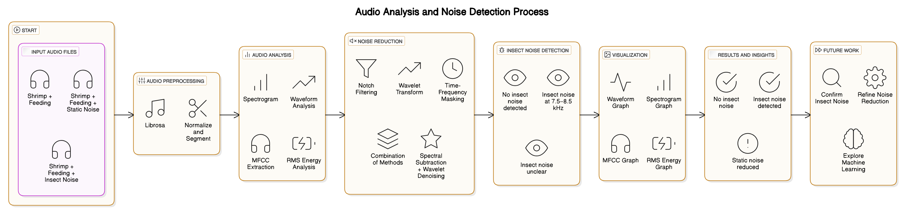

# 🦐 Shrimp Feeding Behaviour Analysis In Complex Aquatic Audio Environments

> *"Feeding insights beneath the waves—powered by audio, enhanced by science."*

## 📌 Overview

**ShrimpAnalysis** explores the world of underwater audio to detect shrimp feeding behavior. Using audio signal processing and noise reduction, it identifies meaningful snapping and feeding sounds in noisy aquaculture environments.

---

## 🎯 Objectives

- Detect shrimp snaps and feeding events from real underwater recordings  
- Analyze acoustic patterns and frequency anomalies caused by insect interference  
- Apply denoising techniques to isolate shrimp sounds effectively  
- Visualize shrimp feeding behavior through Clicks Per Second (CPS) and spectrograms  

---

## 🗂️ Audio Datasets

| File Type     | Description |
|---------------|-------------|
| **NoNoise**     | Contains only shrimp and feeding noises |
| **NoiseType1**  | Shrimp, feeding, and background static noise |
| **NoiseType2**  | Shrimp, feeding, and insect noise (notably between 7.5–8.5 kHz) |

---

## 🧪 Methodology

### Preprocessing
- Bandpass filter (2000–6000 Hz) to isolate shrimp acoustic range  
- Use of `find_peaks()` for click detection  
- Moving average smoothing for temporal behavior analysis  

### Feature Extraction
- RMS Energy  
- MFCC (Mel-Frequency Cepstral Coefficients)  
- Spectrogram analysis (especially to detect insect noise)  

### Noise Reduction Techniques

| Method | Effectiveness |
|--------|---------------|
| Notch Filtering | ❌ Ineffective |
| Time-Frequency Masking | ⚠️ Over-removal of signals |
| Wavelet Transform | ⚠️ Mild improvement |
| **Spectral Subtraction + Wavelet Denoising** | ✅ Best results (≈80% noise reduction) |

---

## 📊 Results

- Clear detection of shrimp snaps in `NoNoise`  
- Insect interference prominent in `NoiseType2` within the 7.5–8.5 kHz range  
- Significant noise reduction in `NoiseType1` using hybrid denoising  
- CPS plots reveal shrimp feeding events across time windows  

---

## 🧭 Limitations & Future Scope

### Limitations
- Dataset size limits generalization  
- Static noise in `NoiseType1` partially persistent  

### Future Work
- Incorporate ML/DL-based audio classification  
- Expand dataset with labeled feeding and non-feeding events  
- Develop real-time monitoring tools for smart shrimp farming  

---

## 📚 Reference

Detailed report and literature review can be found in:  
📄 [`Project Report.pdf`](https://github.com/nithinkodipyaka/ShrimpAnalysis/blob/main/Project%20Report.pdf)

---

## 👨‍💻 Author

**Nithin Kodipyaka**  
ID: 20MIA1075  
Capstone Project under Dr. Suganya G  
School of CSE, VIT

---

## 🧠 How to Use

1. Clone the repository from GitHub  
2. Install necessary dependencies (see `requirements.txt`)  
3. Run the analysis script or explore Jupyter Notebooks to visualize shrimp acoustic patterns  

---

## ⭐ Show Your Support

If you found this project insightful or helpful, consider giving it a ⭐ on GitHub!
